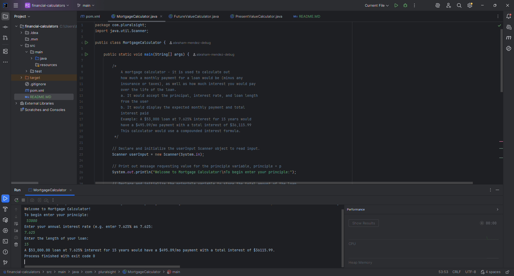
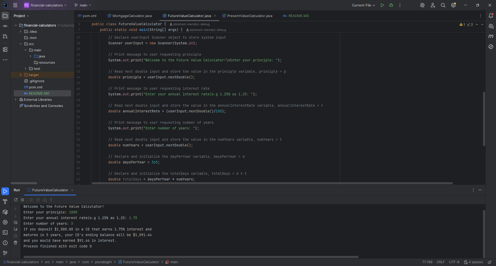
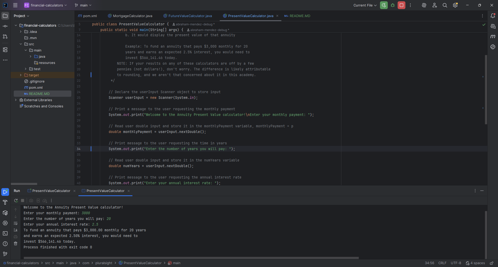
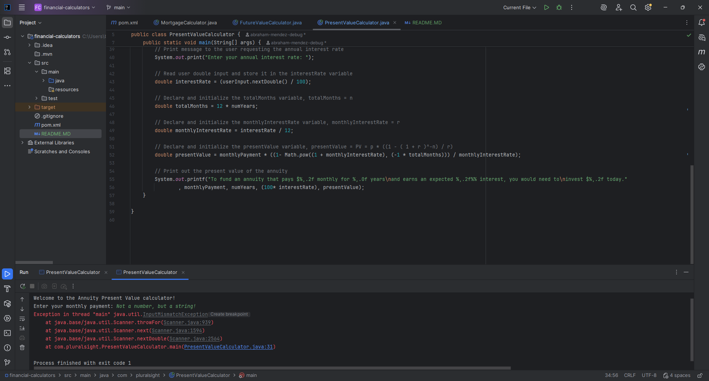
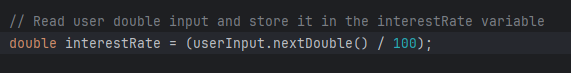
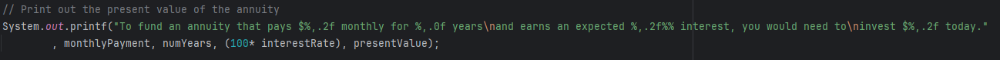

## 📖 Project Overview
This project is a **Java-based financial calculator suite** that demonstrates how to compute common financial values:

* **Mortgage Calculator** – estimates monthly payments.
* **Future Value Calculator** – projects the value of an investment over time.
* **Present Value Calculator** – determines how much an annuity or investment is worth today.

The calculators:
* Accept user inputs such as principal, interest rate, and time.
* Validate inputs and provide error messages for invalid entries.
* Use financial formulas to produce accurate outputs.

This project was built to strengthen skills in **Java programming, input validation, mathematical formulas, and user-friendly design.**

## 🖥️ Screenshots

### Home screen

### Mortgage Calculator

### Future Value Calculator

### Present Value Calculator

### Note:
These calculators only work with integers or decimals. Invalid input (e.g., letters or symbols) produces an error message

## 💡 Interesting Code: Percentage Handling

### Why It’s Interesting

* Mathematically, 0.1 represents 10%, but this is not intuitive for most users.
* I designed the program to accept user input in a more natural form (e.g., entering 10 for 10%).
* Internally, the value is converted into decimal form for calculations, then reversed back for display.

This approach improved **usability** while maintaining **mathematical accuracy**, which is an important lesson in user-friendly design.